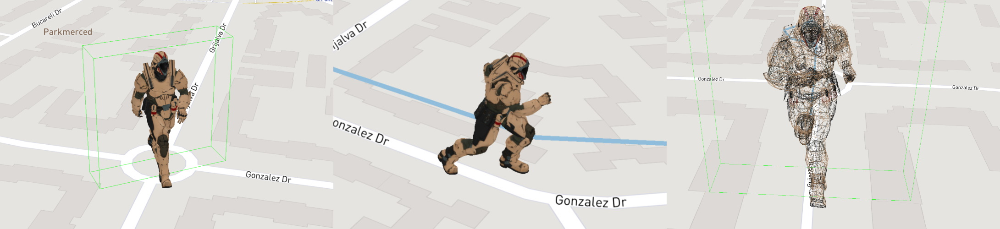

# `Threebox`


[](https://github.com/jscastro76/threebox/releases/)
[](https://www.npmjs.org/package/threebox-plugin)
[](https://www.npmjs.org/package/threebox-plugin)

A **[*Three.js*](https://threejs.org/)** plugin for **[*Mapbox GL JS*](https://docs.mapbox.com/mapbox-gl-js/examples/)** and **[*Azure Maps*](https://azure.microsoft.com/en-us/services/azure-maps/)** using the [`CustomLayerInterface`](https://docs.mapbox.com/mapbox-gl-js/api/properties/#customlayerinterface) feature. Provides convenient methods to manage objects in lnglat coordinates, and to synchronize the map and scene cameras.


<br>

- - -
## Latest release

  
Latest  **code release** is [](https://github.com/jscastro76/threebox/releases/), please review the [**Change log**](https://github.com/jscastro76/threebox/blob/master/CHANGELOG.md) for more details.

Threebox is also available as an **nmp package** [](https://www.npmjs.org/package/threebox-plugin)  

```js
npm i threebox-plugin
```
<br>

- - -

## ONLY in this Threebox fork

|Models built-in & custom animations |Mouse over/out, Selected, Drag&Drop, Drag&Rotate, Wireframe 
|---------|-----------------------
||

|Tooltips using altitude|Optimization of camera perspective and depth
|----------|-------
||

|Runtime style change|Optimized performance through cache
|----------|-------
||

|Customizable FOV|Geojson and Points Extrusions
|---------|-------
||

|Sunlight illumination for a given datetime and lnglat|Models built-in shadows and sky layer synced with Sunlight
|---------|-------
||

<br>

Only in this fork, there is a list of new features implemented on top of the amazing work from [@peterqliu](https://github.com/peterqliu/threebox/):
- Updated to [**Three.js r132**](https://github.com/mrdoob/three.js/releases/tag/r132).
- Updated to **Mapbox-gl-js v2.2.0**.
- Updated to **Azure Maps v2.0.31**.
- [+20 examples](https://github.com/jscastro76/threebox/tree/master/examples) with all the new features.
- Support for multiple 3D format objects (FBX, GLTF/GLB, Collada, OBJ/MTL).
- Support for 3D extruded shapes from [GeoJson](https://geojson.org/) features or points array.
- Support for CSS2D labels and rich HTML controls through a new LabelManager.
- Support for CSS2D tooltips/title browser-like and mapbox-like.
- Support for built-in Raycaster in Object3D and fill-extrusions together.
- Support for built-in MouseOver/Mouseout, Selected, Drag&Drop, Drag&Rotate, Wireframe in loadedObjects including events.
- Support for wireframing on any Object3D, removing them from the Raycaster.
- Support for [GeoJson](https://geojson.org/) standard features format import and export in different layers.
- Support for Object3D embedded animations, and custom animations on AnimationManager (i.e. embedded animation + translate + rotate).
- Support for multi-layer and multi-floor design of spaces.
- Support for built-in shadows and real Sun light positioning for a given datetime and lnglat coords.
- Support for built-in Mapbox v2 Sky and Terrain layer synced with real Sun light.
- Support for Non-AABB Non Axes Aligned Bounding Box and real model size, including floor projection. 
- Support for Object3D auto-centering and 9 default anchor positions customizable through adjustments.
- Support for `setLayerZoomRange` and `setLayoutProperty` on Custom Layers (not available in Mapbox).
- Support for `removeLayer` considering Object3D.
- Support for style change through `setStyle` and keeping Object3D.
- Support for partial and full dispose of Mapbox, Three and Threebox resources and memory.
- Support for Orthographic view, customizable Perspective FOV and fixed-size Object3D.
- Optimization of Camera perspective to have Raycast with pixel-precision level and depth sync between Mapbox and Threebox objects.
- Optimization for loading thousands of objects through cache.
- Available as [npm package](https://www.npmjs.com/package/threebox-plugin)
- Check out [change log](https://github.com/jscastro76/threebox/blob/master/CHANGELOG.md) for more detail.

<br>

- - -


## Documentation


All the [**Threebox Documentation**](/docs/Threebox.md) has been completely updated, including all the methods, properties and events implemented in Threebox and objects, but still *'work in progress'* adding better documented examples and images to illustrate Threebox capabilities.
- [**Using Threebox**](/docs/Threebox.md#using-threebox)
- [**Loading a 3D Model**](/docs/Threebox.md#loading-a-3d-model)
- [**Threebox methods**](/docs/Threebox.md#threebox-methods)
- [**Object methods**](/docs/Threebox.md#object-methods)
- [**Examples**](/examples/README.md)

<br>

- - -

## Compatibility/Dependencies

- [**Three.js 132**](https://github.com/mrdoob/three.js/releases/tag/r132). (already bundled into the Threebox build). If desired, other versions can be swapped in and rebuilt [here](https://github.com/jscastro76/threebox/blob/master/src/three.js), though compatibility is not guaranteed.
- **Mapbox-gl-js v1.11.1. or v.2.0.1**. **Warning**: Despite v1.11.1 still supported, if used, some features from mapbox v.2.0.1 won't be obviously available such as sky layers. 
- **Azure Maps v2.0.31.**

<br>

- - -

## Getting started

You can use threebox in three different ways. 

#### NPM install
Add threebox to your project via **npm package** [](https://www.npmjs.org/package/threebox-plugin) :
```js
npm install threebox-plugin
```   

Then you will need to import Threebox object in your code. Depending your javascript framework this might be different. 
```js 
import { Threebox } from 'threebox-plugin'; 
```  
Depending the framework, wrapper or bundler you ar using, try with this:
```js 
import { Threebox } from 'threebox-plugin/dist/threebox'; 
```  

<br/>

#### Use the bundle locally
Download the bundle from [`dist/threebox.js`](dist/threebox.js) or [`dist/threebox.min.js`](dist/threebox.min.js) and include it in a `<script>` tag on your page.  
If you want to use styles predefined, add the link to the cascade style sheet, just ensure the `src` and `href` attributes are pointing to relative or absolute url path.  
```html
<script src="../dist/threebox.js" type="text/javascript"></script>
<link href="../dist/threebox.css" rel="stylesheet" />
```
<br/>

#### Public CDNs
Threebox can be also used from different public CDNs:  

##### jsdelivr
This CDN has the particularity that always requires the version of the package to download individual files.
```html
<script src="https://cdn.jsdelivr.net/gh/jscastro76/threebox@v.2.2.2/dist/threebox.min.js" type="text/javascript"></script>
<link href="https://cdn.jsdelivr.net/gh/jscastro76/threebox@v.2.2.2/dist/threebox.css" rel="stylesheet" />
```

<br/>

##### unpkg
Despite this CDN admits version, if omitted, it will download always the last one published.

```html
<script src="https://unpkg.com/threebox-plugin/dist/threebox.min.js" type="text/javascript"></script>
<link href="https://unpkg.com/threebox-plugin/dist/threebox.css" rel="stylesheet" />
```

For an specific version (i.e. v2.2.1) use the followin:
```html
<script src="https://unpkg.com/threebox-plugin@2.2.1/dist/threebox.min.js" type="text/javascript"></script>
<link href="https://unpkg.com/threebox-plugin@2.2.1/dist/threebox.css" rel="stylesheet" />
```

<br/>

#### Test the samples 
Several introductory examples are [here](https://github.com/jscastro76/threebox/tree/master/examples).  
To run them, create a `config.js` file with your Mapbox-gl-js access token, alongside and in the format of [the template](https://github.com/jscastro76/threebox/blob/master/examples/config_template.js).

<br>

- - -

## Contributing
- Clone the [Github repo](https://github.com/jscastro76/threebox/).
- Build the library with `npm run build` to get the minimized version, or `npm run dev` to get the development version and rebuild continuously as you develop. 
- Both commands will output a bundle in [`dist/`](dist/) folder.

#### Unit tests
Tests live [here](/tests). 
- Build first the test bundle with `npm run test`, this will create [`tests\threebox-tests-bundle.js`](tests/threebox-tests-bundle.js)  
- Then in your preferred browser navigate to [`threebox-tests.html`](https://github.com/jscastro76/threebox/blob/master/tests/threebox-tests.html) and check the console for test results.

#### How to build the project in Visual Studio
Sample to get a full build from scratch for Visual Studio:
- Install [Node.js](https://nodejs.org/en/) 
- Clone the repo and open a new Project using main.js
- Install / Update the packages browserify, tape, ncp, uglyfy, watchify.
- Right click on the project at the Solution Explorer > Open Node.js Interactive Window:
- execute `.npm [ProjectName] init -y`
- execute `.npm [ProjectName] install`
- execute `.npm [ProjectName] i`
- execute `.npm [ProjectName] run dev` or `.npm run build
`


