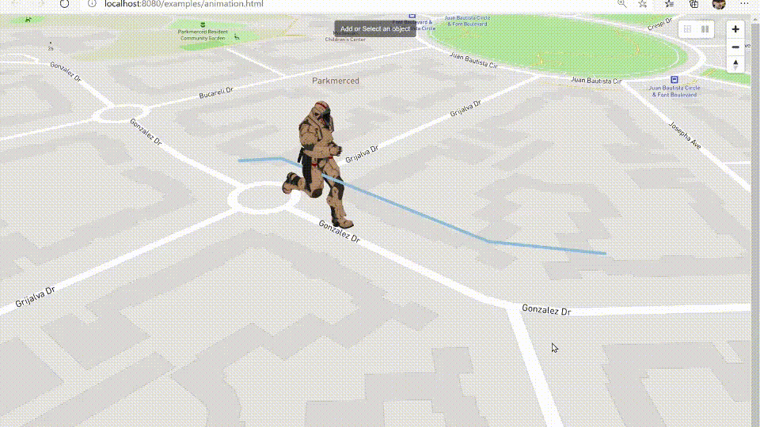
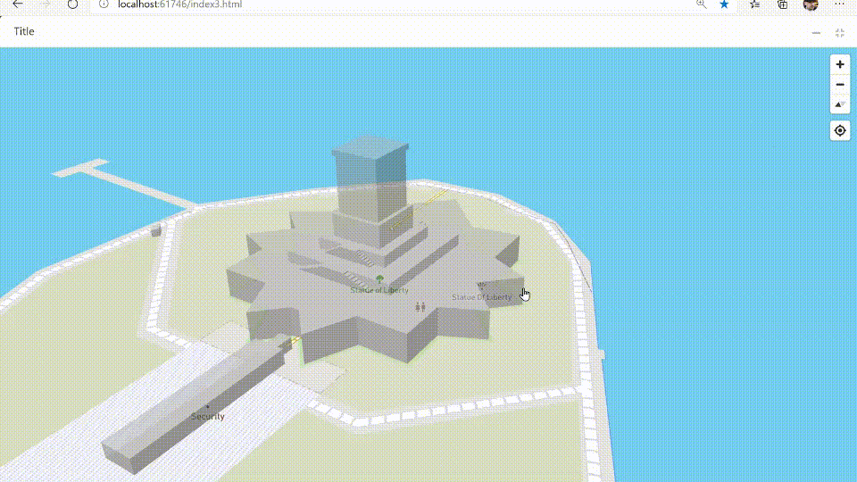
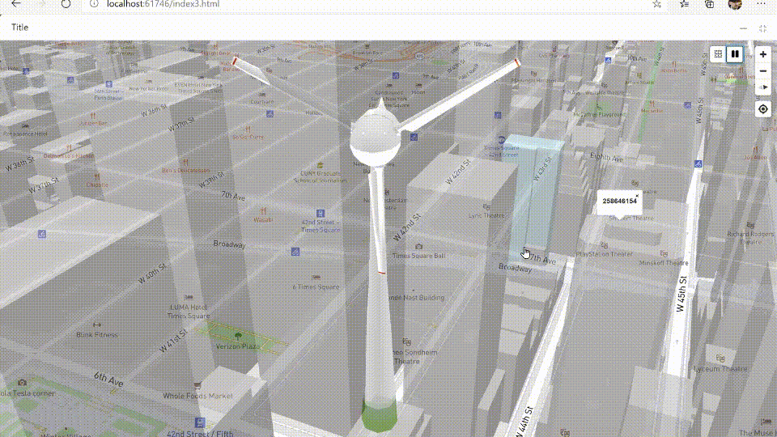
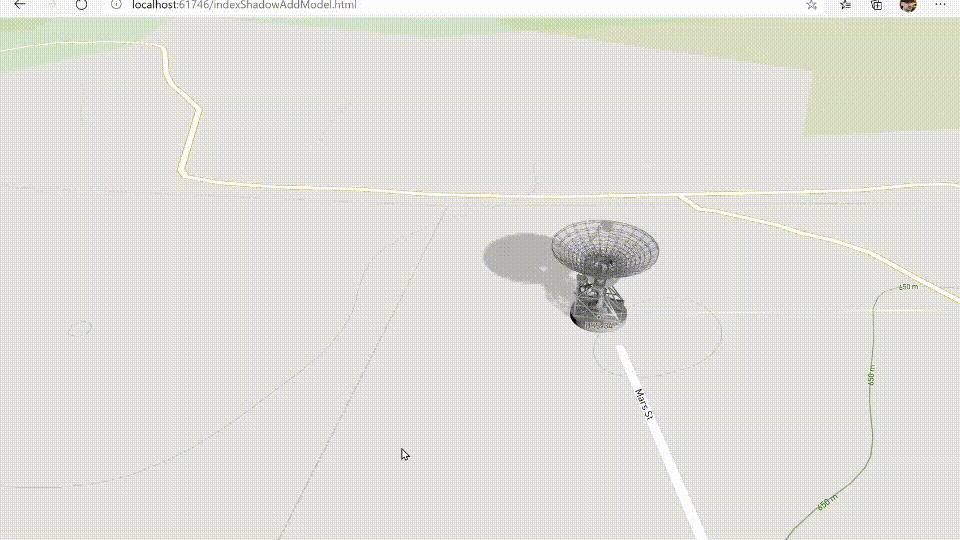
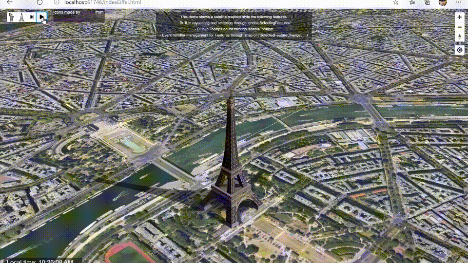

# `Threebox`

A **[*Three.js*](https://threejs.org/)** plugin for **[*Mapbox GL JS*](https://docs.mapbox.com/mapbox-gl-js/examples/)**, using the [`CustomLayerInterface`](https://docs.mapbox.com/mapbox-gl-js/api/properties/#customlayerinterface) feature. Provides convenient methods to manage objects in lnglat coordinates, and to synchronize the map and scene cameras.

 

- - -
## Current release

Current release is [**2.0.7**](https://github.com/jscastro76/threebox/releases/tag/v.2.0.7), please review the [**Change log**](https://github.com/jscastro76/threebox/blob/master/CHANGELOG.md#207) for more details.

 

- - -

## ONLY in this Threebox fork

|Models built-in & custom animations |MouseOver/Mouseout, Selected, Drag&Drop, Drag&Rotate, Wireframe 
|---------|-----------------------
||

|Tooltips using altitude|Optimization of camera perspective and depth
|----------|-------
||

|Models built-in shadows|Sunlight illumination for a given datetime and lnglat
|----------|-------
||

 

Only in this fork, there is a list of new features implemented on top of the amazing work from [@peterqliu](https://github.com/peterqliu/threebox/):
- Update to Three.js v117.
- Update to Mapbox-gl-js v1.11.1.
- [15 examples](https://github.com/jscastro76/threebox/tree/master/examples) with new features.
- Support for multiple format objects (FBX, GLTF/GLB, Collada + OBJ/MTL).
- Support for CSS2D labels supporting rich HTML controls through a new LabelManager.
- Support for CSS2D tooltips/title browser-like and mapbox-like.
- Support for Objects3D auto-centering, bounding box and floor projection.
- Support for built-in shadows and real Sun light positioning for a given datetime and lnglat coords.
- Support for built-in Raycaster in loaded Objects3D and fill-extrusions together.
- Support for built-in MouseOver/Mouseout, Selected, Drag&Drop, Drag&Rotate, Wireframe in loadedObjects including events.
- Support for GeoJson standard features format import and export in different layers.
- Support for Objects3D embedded animations, and combined animations on AnimationManager (i.e. translate + embedded).
- Support for multi-floor design of spaces.
- Support for style change through `setStyle` and keeping 3D models.
- Support for Non-AABB Non Axes Aligned Bounding Box and real model size. 
- Support for wireframing on Objects3D, removing them from the raycast.
- Support for `setLayerZoomRange` and `setLayoutProperty` on Custom Layers (not available in Mapbox).
- Support for `removeLayer` considering 3D objects.
- Support for partial and full dispose of Mapbox, Three and Threebox resources and memory.
- Optimization for loading thousands of objects through cache.
- Optimization of Camera perspective to have Raycast with pixel-precision level.
- Adjusted positioning for Objects3D to set center and rotation axes by config.
- Check out [v2.0.7 change log](https://github.com/jscastro76/threebox/blob/master/CHANGELOG.md#207) for more detail.

 

- - -

## Documentation

All the [**Threebox Documentation**](/docs/Threebox.md) has been completely updated, including all the methods, properties and events implemented in Threebox and objects, but still *'work in progress'* adding better documented examples and images to illustrate Threebox capabilities.
- [**Using Threebox**](/docs/Threebox.md#using-threebox)
- [**Loading a 3D Model**](/docs/Threebox.md#loading-a-3d-model)
- [**Threebox methods**](/docs/Threebox.md#threebox-methods)
- [**Object methods**](/docs/Threebox.md#object-methods)
- [**Examples**](/examples/README.md)

 

- - -

## Compatibility/Dependencies

- Three.r117 (already bundled into the Threebox build). If desired, other versions can be swapped in and rebuilt [here](https://github.com/jscastro76/threebox/blob/master/src/three.js), though compatibility is not guaranteed. **(WARNING: v118.3 breaks compatibility in some cases)**
- Mapbox-gl-js v1.11.1.

 

- - -

## Getting started

Download the bundle from [`dist/threebox.js`](dist/threebox.js) or [`dist/threebox.min.js`](dist/threebox.min.js) and add include it in a `<script>` tag on your page.

Several introductory examples are [here](https://github.com/jscastro76/threebox/tree/master/examples). To run them, create a `config.js` file with your Mapbox-gl-js access token, alongside and in the format of [the template](https://github.com/jscastro76/threebox/blob/master/examples/config_template.js).

 

- - -

## Contributing

Build the library with `npm run build`, or `npm run dev` to rebuild continuously as you develop. 
Both commands will output a bundle in `/dist/threebox.js`.

### Sample to build the project in Visual Studio
Sample to get a full build from scratch for Visual Studio:
- Install [Node.js](https://nodejs.org/en/) 
- Clone the repo and open a new Project using main.js
- Update the packages @turf, tape, uglyfy, watchify
- Right click on the project at the Solution Explorer > Open Node.js Interactive Window:
- execute `.npm [ProjectName] init -y`
- execute `.npm [ProjectName] install`
- execute `.npm [ProjectName] i`
- execute `.npm [ProjectName] [LocalPath] install azure@4.2.3`
- execute `.npm [ProjectName] run dev` or `.npm run build
`

Tests live [here](/tests) -- run `threebox-tests.html` and check the console for test results.

