## Examples

These are the examples included in Threebox.

##### [01-basic.html](https://github.com/jscastro76/threebox/blob/master/examples/01-basic.html) 
- This sample shows the simplest Threebox use with only a sphere with no interactions. 

##### [02-line.html](https://github.com/jscastro76/threebox/blob/master/examples/02-line.html) 
- This sample line arcs from a central point to different destinations with no interactions.   
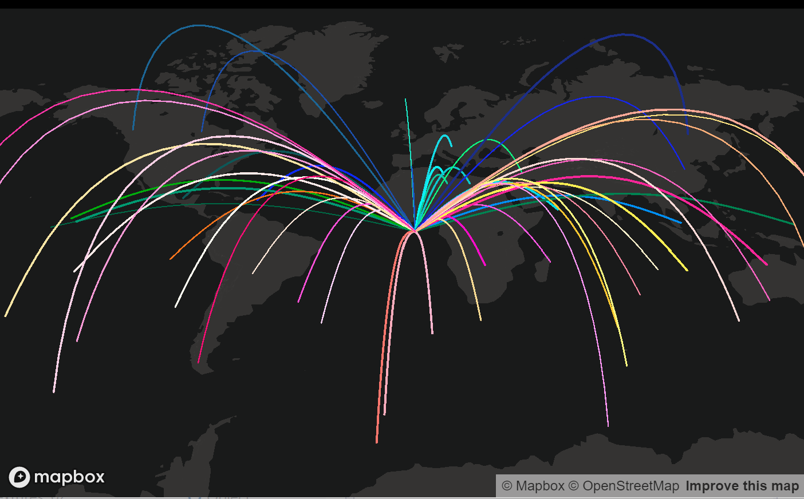

##### [03-tube.html](https://github.com/jscastro76/threebox/blob/master/examples/03-tube.html) 
- This sample creates an spiral tube geometry to render. 
- Enabled built-in raycasting and selection for this 3D object through `enableSelectingObjects`, all objects can be selected and unselected.
- Enabled built-in dragging mode for 3D objects through `enableDraggingObjects`, 3D object is dragabble, once selected, using [Shift] key
- Enabled built-in rotation mode for 3D objects through `enableRotatingObjects`, 3D objects is rotable on it's vertical axis, once selected, using [Alt] key.
- Enabled built-in default Labels on altitude for the 3D object through `enableTooltips`. 
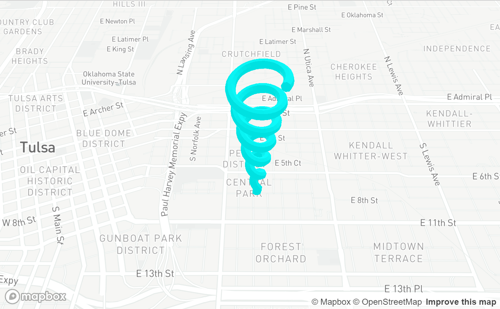

##### [04-mercator.html](https://github.com/jscastro76/threebox/blob/master/examples/04-mercator.html) 
- This sample creates 100 spheres all around the world at the same height, but they look different because the height is calculated based on the latitude. 

##### [05-logistics.html](https://github.com/jscastro76/threebox/blob/master/examples/05-logistics.html) 
- This sample loads a 3D `.obj` model of a truck that is animated following a path once a point in the map is clicked. 
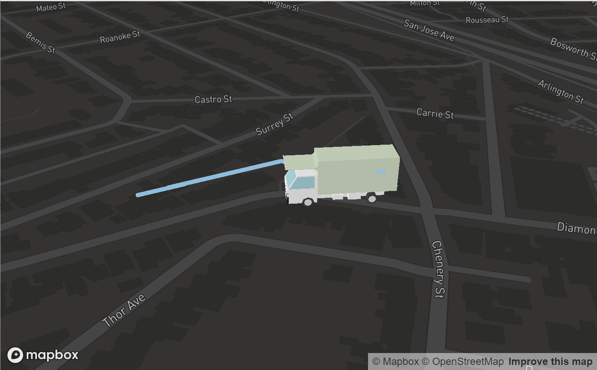

##### [06-object3d.html](https://github.com/jscastro76/threebox/blob/master/examples/06-object3d.html) 
- This sample loads a 3D `.glb` model of a soldier.  

##### [07-alignmentTest.html](https://github.com/jscastro76/threebox/blob/master/examples/07-alignmentTest.html) 
- This sample shows camera alignment between fill-extrusion layer and a 3DObject created through Threebox. 
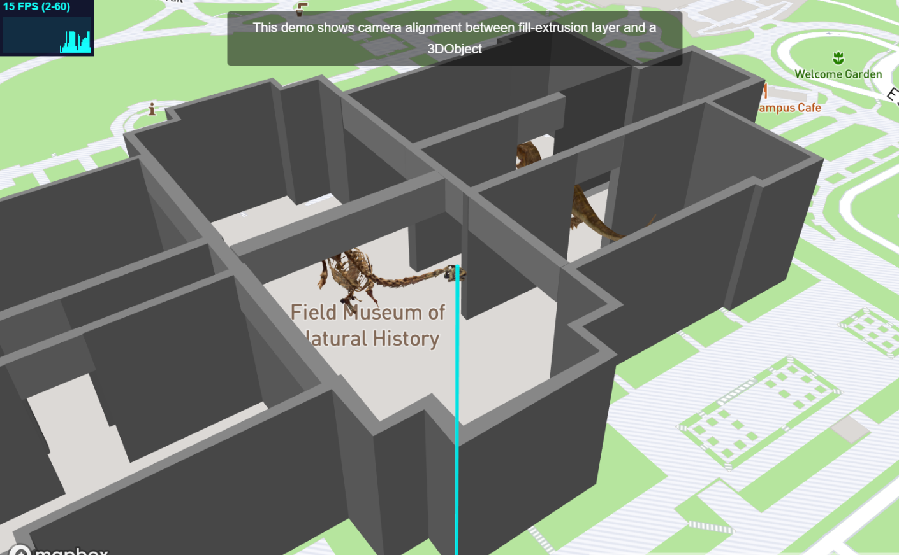

##### [08-3dbuildings.html](https://github.com/jscastro76/threebox/blob/master/examples/08-3dbuildings.html) 
- This sample shows over a default fill-extrusion composite layer different Threebox additions.
- Built-in raycasting and selection through `enableSelectingFeatures` 
- Built-in default Labels on altitude for fill-extrusions through `enableTooltips` 
- Event handler management for Features through `map.on('SelectedFeatureChange', ...)` 
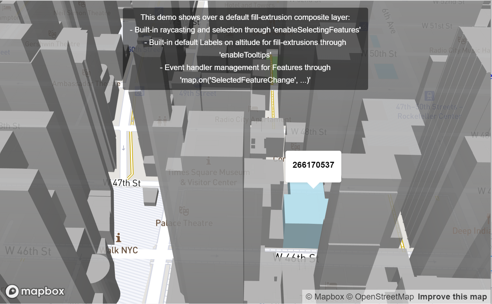

##### [09-raycaster.html](https://github.com/jscastro76/threebox/blob/master/examples/09-raycaster.html) 
- This sample shows how to create 3 objects over a default fill-extrusion composite layer.
- Enabled built-in raycasting and selection both for fill-extrusion and 3D objects through `enableSelectingFeatures` and `enableSelectingObjects`, all objects can be selected and unselected.
- Enabled built-in dragging mode for 3D objects through `enableDraggingObjects`, 3D objects are dragabble, once selected, using [Shift] key
- Enabled built-in rotation mode for 3D objects through `enableRotatingObjects`, 3D objects are rotable on it's vertical axis, once selected, using [Alt] key.
- Enabled built-in default Labels on altitude both for fill-extrusions and 3D objects through `enableTooltips`. 
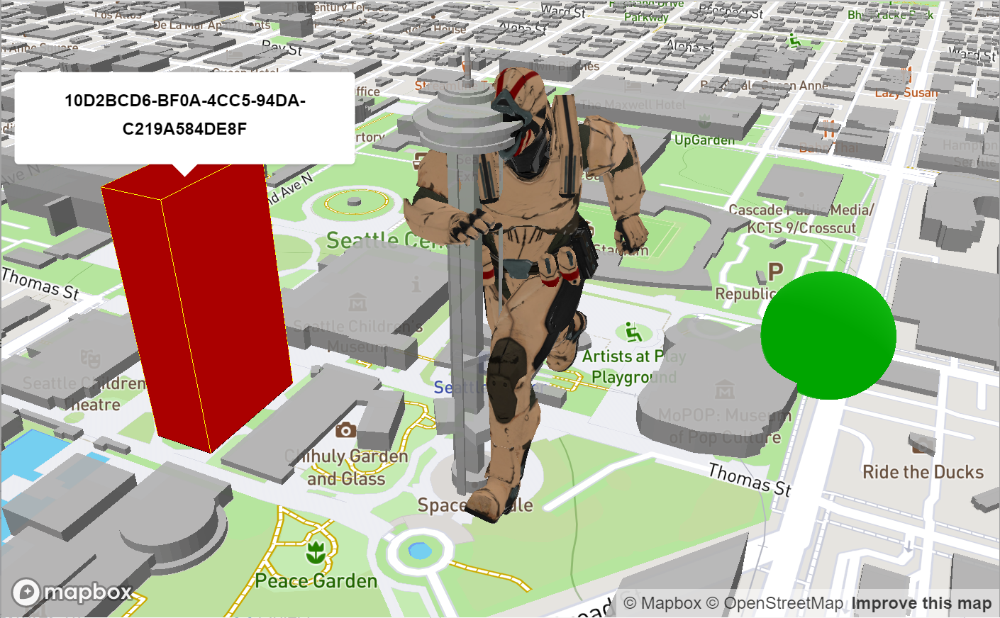

##### [10-stylechange.html](https://github.com/jscastro76/threebox/blob/master/examples/10-stylechange.html) 
- This sample shows how to change the style without affecting the 3D objects created using the method `tb.setStyle`  
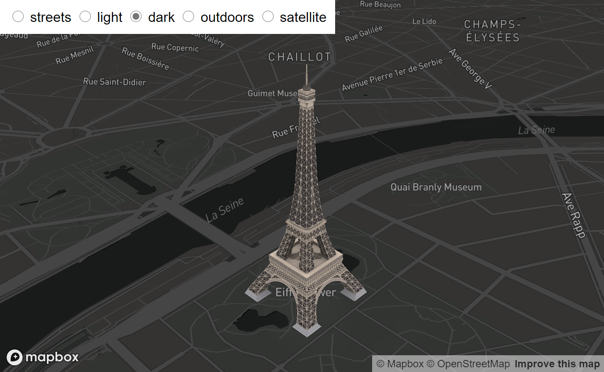

##### [11-animation.html](https://github.com/jscastro76/threebox/blob/master/examples/11-animation.html) 
- This sample is a mix between [05-logistics.html](https://github.com/jscastro76/threebox/blob/master/examples/05-logistics.html) and [09-raycaster.html](https://github.com/jscastro76/threebox/blob/master/examples/09-raycaster.html) samples, and it shows an object can play at the same time an embedded animation and a Threebox animation.  
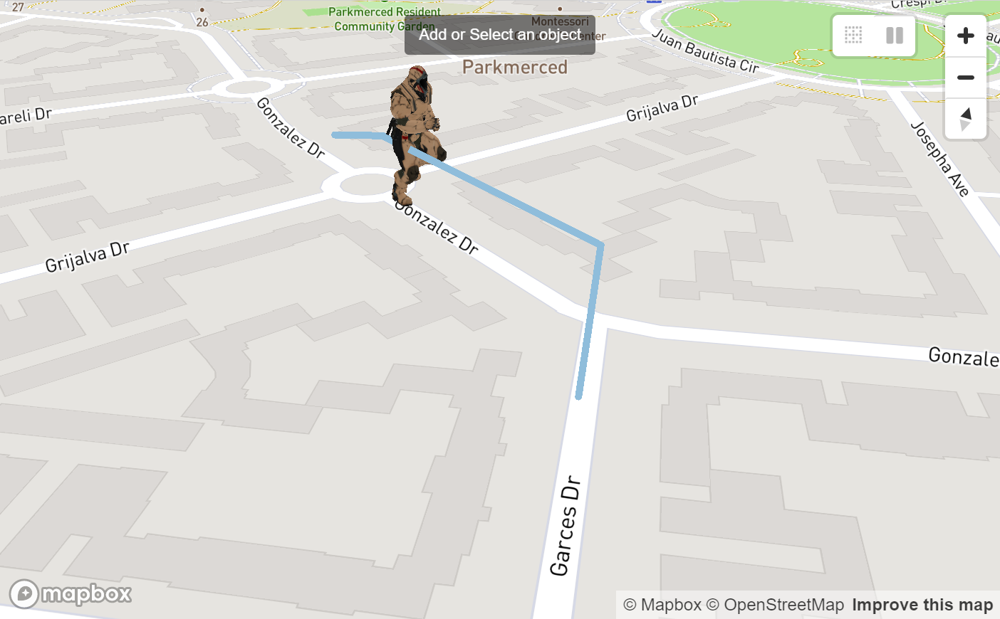

##### [12-add3dmodel.html](https://github.com/jscastro76/threebox/blob/master/examples/12-add3dmodel.html) 
- This sample shows a replica of [add a 3D model sample](https://docs.mapbox.com/mapbox-gl-js/example/add-3d-model/) using only threebox and adding real sunlight position and shadows over the model.
- Enabled built-in raycasting and selection for 3D objects through `enableSelectingObjects`, all objects can be selected and unselected.
- Enabled built-in Tooltips on for through `enableTooltips` 
- Enabled built-in sunlight position for the scene through `realSunlight`
- Enabled built-in shadows for 3D Objects through `castShadow`.
- Set the time map lights based on `setSunlight` for today.
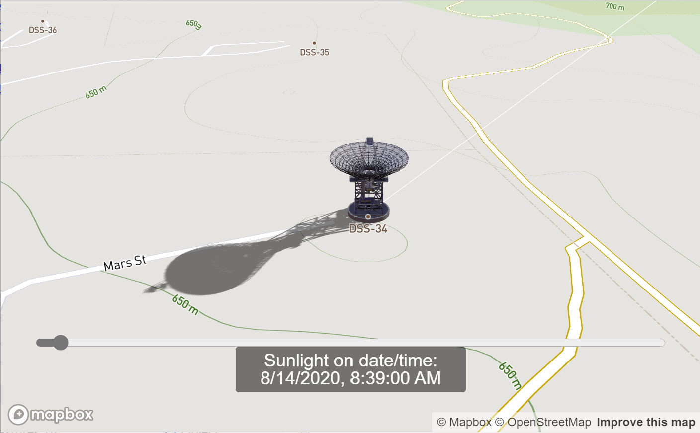

##### [13-eiffel.html](https://github.com/jscastro76/threebox/blob/master/examples/13-eiffel.html) 
- This sample shows how to  add real sunlight position and shadows over two landmarks, Eiffel Tower and Liberty Statue, using the Satellite mapbox style.
- Enabled built-in raycasting and selection for 3D objects through `enableSelectingObjects`, all objects can be selected and unselected.
- Enabled built-in Tooltips on for through `enableTooltips` 
- Enabled built-in sunlight position for the scene through `realSunlight`
- Enabled built-in shadows for 3D Objects through `castShadow`.
- Set the time map lights based on `setSunlight` for today.
 
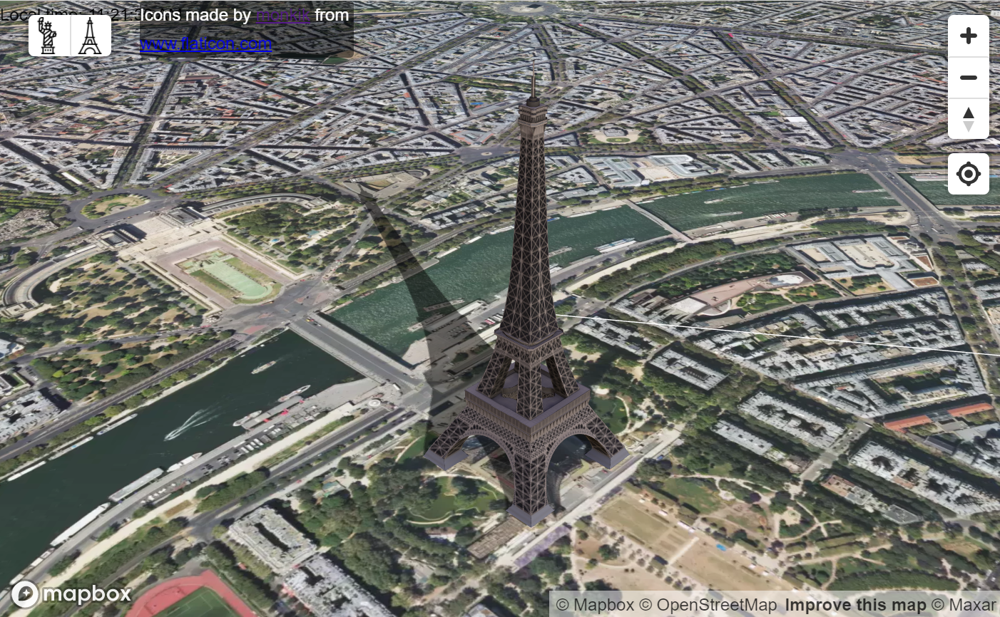

##### [14-buildingshadow.html](https://github.com/jscastro76/threebox/blob/master/examples/14-buildingshadow.html) 
- This sample shows how to to add real sunlight position and shadows over a default fill-extrusion composite layer. 
- Enabled built-in sunlight position for the scene through `realSunlight`.
- Enabled built-in fill-extrusion shadows through `tb.setBuildingShadows`.  
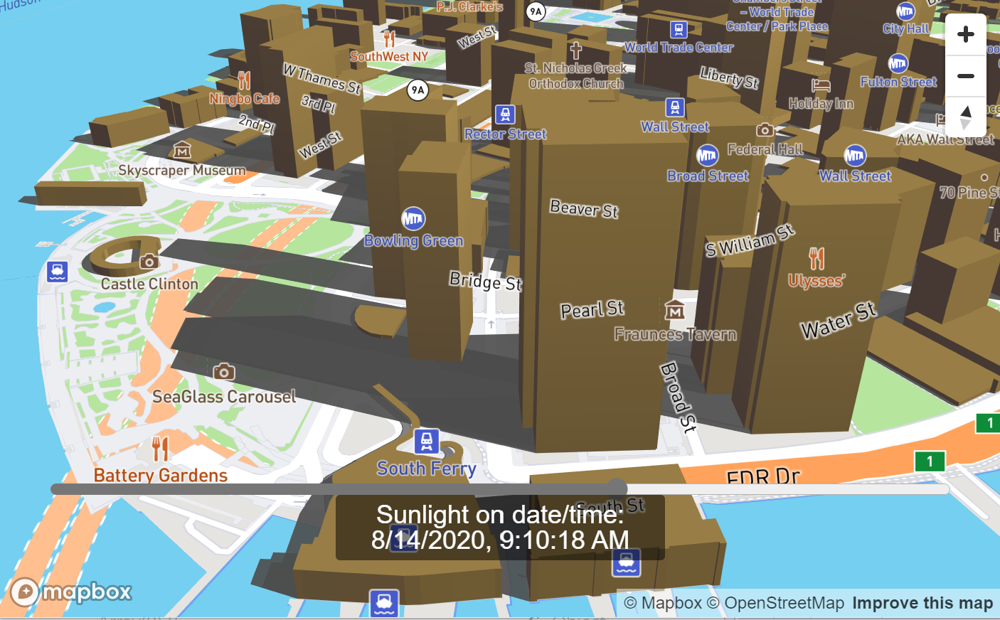

##### [15-performance.html](https://github.com/jscastro76/threebox/blob/master/examples/15-performance.html) 
- This sample shows the performance of Threebox creating up to 1000 objects in a single layer.  
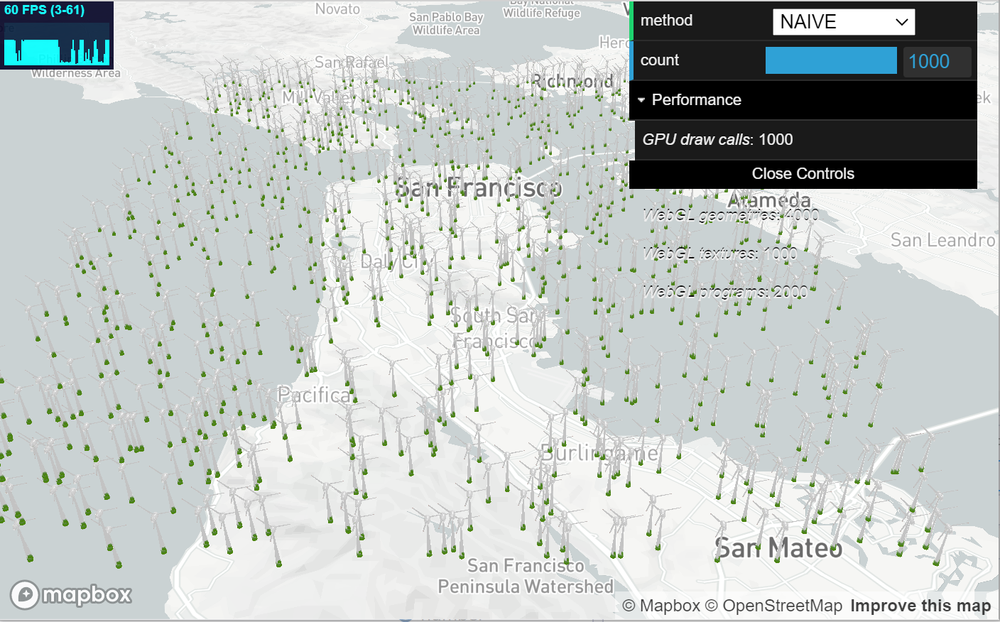
