## Examples

These are the examples included in Threebox.

#### [01-basic.html](https://github.com/jscastro76/threebox/blob/master/examples/01-basic.html) 
 
- This sample shows the simplest Threebox use with only a sphere with no interactions. 
- Updated to Mapbox 2.2.0
- - - -

#### [02-line.html](https://github.com/jscastro76/threebox/blob/master/examples/02-line.html) 
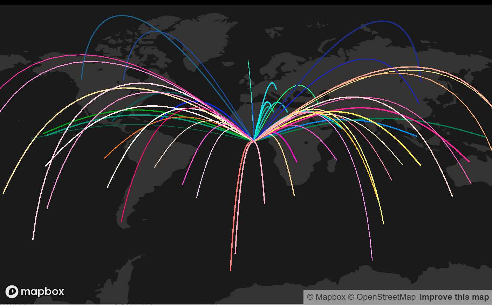 
- This sample line arcs from a central point to different destinations with no interactions.   
- Updated to Mapbox 2.2.0
- - - -

#### [03-tube.html](https://github.com/jscastro76/threebox/blob/master/examples/03-tube.html) 
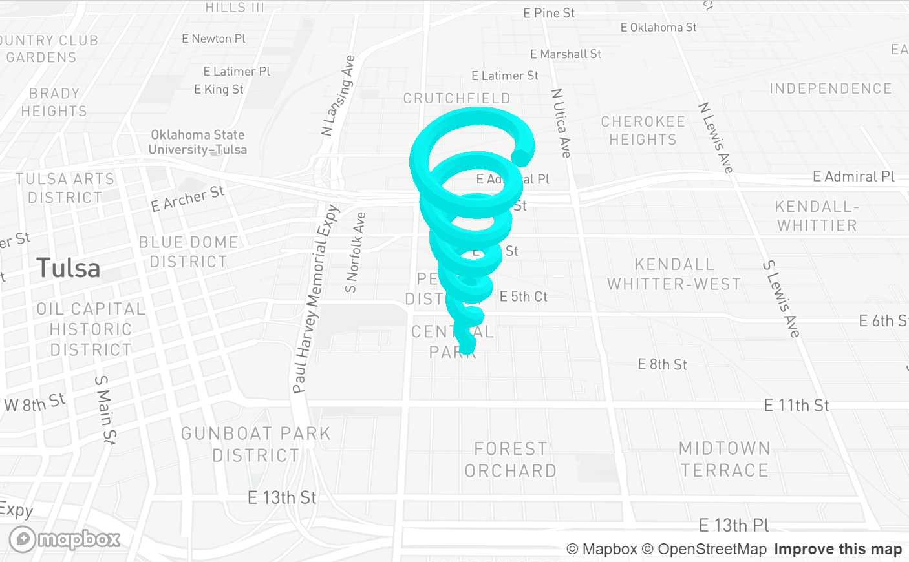 
- This sample creates an spiral tube geometry to render. 
- Enabled built-in raycasting and selection for this 3D object through `enableSelectingObjects`, all objects can be selected and unselected.
- Enabled built-in dragging mode for 3D objects through `enableDraggingObjects`, 3D object is dragabble, once selected, using [Shift] key for translation and [Ctrl] for altitude.
- Enabled built-in rotation mode for 3D objects through `enableRotatingObjects`, 3D objects is rotable on it's vertical axis, once selected, using [Alt] key.
- Enabled built-in default Labels on altitude for the 3D object through `enableTooltips`. 
- Enabled built-in default help Labels when dragged, rotated or measured.  
- Updated to Mapbox 2.2.0
- - - -

#### [04-mercator.html](https://github.com/jscastro76/threebox/blob/master/examples/04-mercator.html) 
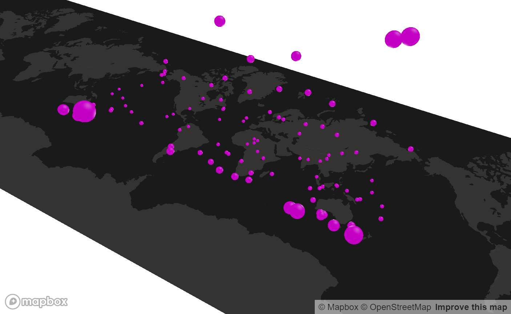 
- This sample creates 100 spheres duplicated all around the world at the same height, but they look different because the height is calculated based on the latitude. 
- Updated to Mapbox 2.2.0
- - - -

#### [05-logistics.html](https://github.com/jscastro76/threebox/blob/master/examples/05-logistics.html) 
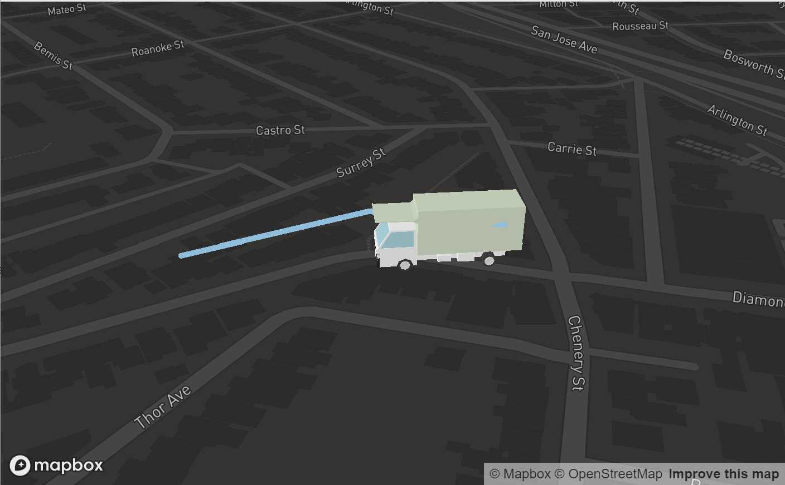 
- This sample loads a 3D `.obj` model of a truck that is animated following a path once a point in the map is clicked. 
- The model is attached to the event `ObjectChanged`.
- Updated to Mapbox 2.2.0
- - - -

#### [06-object3d.html](https://github.com/jscastro76/threebox/blob/master/examples/06-object3d.html) 
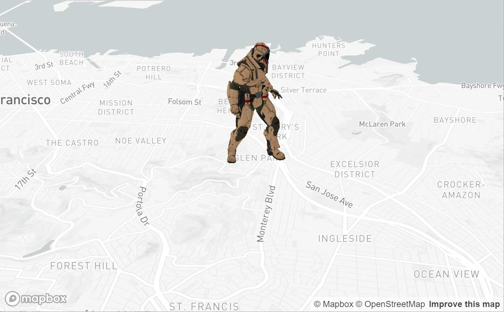   
- This sample loads a 3D `.glb` model of a soldier.   
- Updated to Mapbox 2.2.0
- - - -

#### [07-alignmentTest.html](https://github.com/jscastro76/threebox/blob/master/examples/07-alignmentTest.html) 
 
- This sample shows camera perspective and depth alignment between fill-extrusion layer and some Object3D created through Threebox. 
- Enabled built-in atmospheric sky layer added through `sky: true` param.
- Updated to Mapbox 2.2.0
- - - -  

#### [08-3dbuildings.html](https://github.com/jscastro76/threebox/blob/master/examples/08-3dbuildings.html) 
 
- This sample shows over a default fill-extrusion composite layer different Threebox additions.
- Built-in raycasting and selection through `enableSelectingFeatures` 
- Built-in default Labels on altitude for fill-extrusions through `enableTooltips` 
- Event handler management for Features through `map.on('SelectedFeatureChange', ...)` 
- Enables the user to change dynamically the FOV for Perspective camera. 
- Updated to Mapbox 2.2.0
- - - -

#### [09-raycaster.html](https://github.com/jscastro76/threebox/blob/master/examples/09-raycaster.html) 
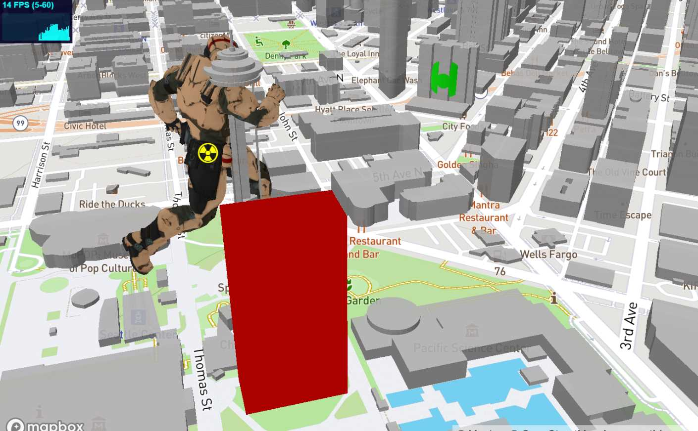 
- This sample shows how to create 3 objects over a default fill-extrusion composite layer and how they are affected by the perspective FOV.
- Enabled built-in raycasting and selection both for fill-extrusion and 3D objects through `enableSelectingFeatures` and `enableSelectingObjects`, all objects can be selected and unselected.
- Enabled built-in dragging mode for 3D objects through `enableDraggingObjects`, 3D objects are dragabble, once selected, using [Shift] key for translation and [Ctrl] for altitude.
- Enabled built-in rotation mode for 3D objects through `enableRotatingObjects`, 3D objects are rotable on it's vertical axis, once selected, using [Alt] key.
- Enabled built-in default Labels on altitude both for fill-extrusions and 3D objects through `enableTooltips`. 
- Enables the user to change dynamically the FOV for Perspective camera and the option to set an Orthographic camera. 
- Updated to Mapbox 2.2.0
- - - -

#### [10-stylechange.html](https://github.com/jscastro76/threebox/blob/master/examples/10-stylechange.html) 
 
- This sample shows how to change the style without affecting the 3D objects created using the method `tb.setStyle`  
- Updated to Mapbox 2.2.0
- - - -

#### [11-animation.html](https://github.com/jscastro76/threebox/blob/master/examples/11-animation.html) 
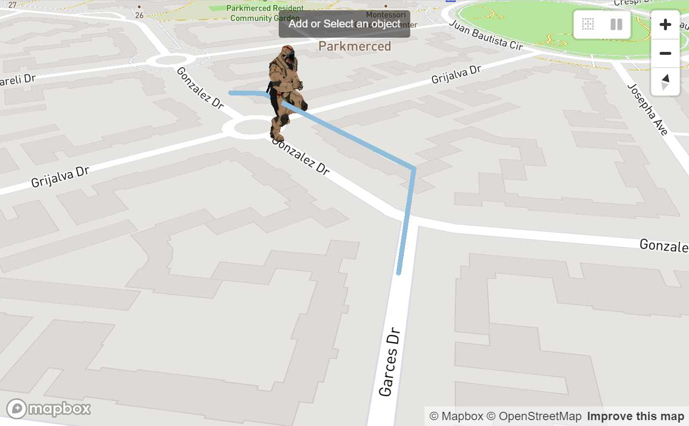 
- This sample is a mix between [05-logistics.html](https://github.com/jscastro76/threebox/blob/master/examples/05-logistics.html) and [09-raycaster.html](https://github.com/jscastro76/threebox/blob/master/examples/09-raycaster.html) samples, and it shows an object can play at the same time an embedded animation and a Threebox animation.  
- Updated to Mapbox 2.2.0
- - - -

#### [12-add3dmodel.html](https://github.com/jscastro76/threebox/blob/master/examples/12-add3dmodel.html) 
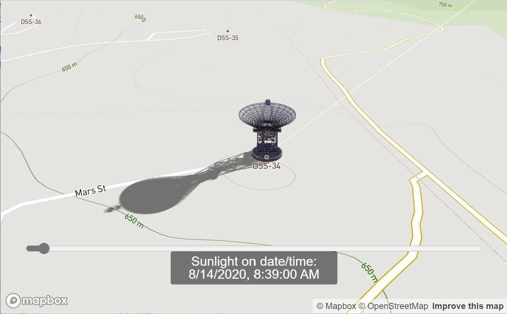 
- This sample shows a replica of [add a 3D model sample](https://docs.mapbox.com/mapbox-gl-js/example/add-3d-model/) using only threebox and adding real sunlight position and shadows over the model.
- Enabled built-in raycasting and selection for 3D objects through `enableSelectingObjects`, all objects can be selected and unselected.
- Enabled built-in Tooltips on for through `enableTooltips` 
- Enabled built-in sunlight position for the scene through `realSunlight`
- Enabled built-in shadows for 3D Objects through `castShadow`.
- Enabled built-in atmospheric sky layer added through `sky: true` param.
- Set the time map lights based on `setSunlight` for today.
- Changes automatically the style from sunset to sunrise through `tb.getSunTimes`.
- Updated to Mapbox 2.2.0

- - - -

#### [13-eiffel.html](https://github.com/jscastro76/threebox/blob/master/examples/13-eiffel.html) 
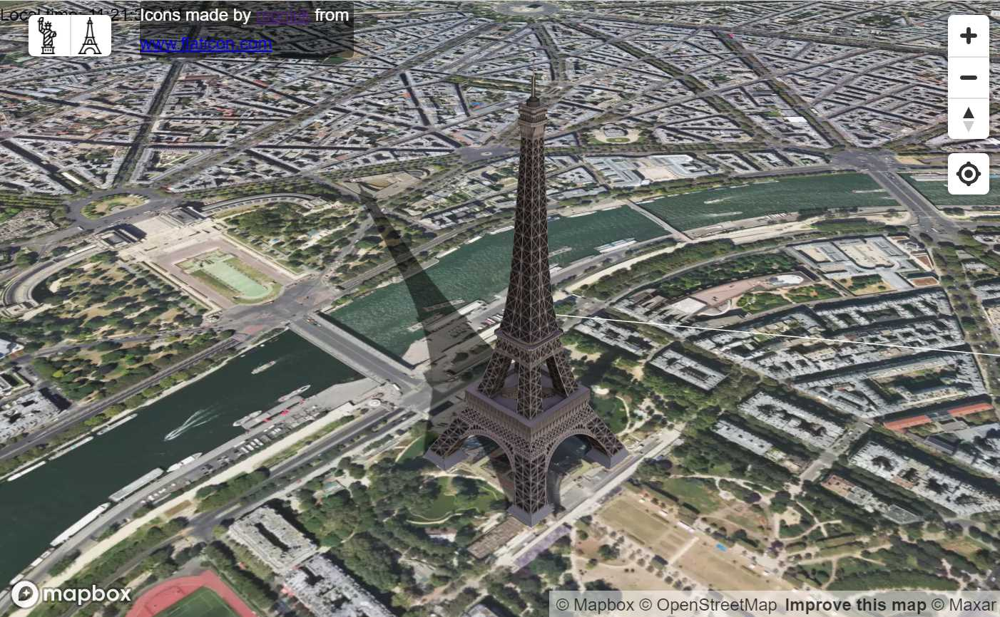 
- This sample shows how to  add real sunlight position and shadows over two landmarks, Eiffel Tower and Liberty Statue, using the Satellite mapbox style.
- Enabled built-in raycasting and selection for 3D objects through `enableSelectingObjects`, all objects can be selected and unselected.
- Enabled built-in Tooltips on for through `enableTooltips` 
- Enabled built-in sunlight position for the scene through `realSunlight`
- Enabled built-in shadows for 3D Objects through `castShadow`.
- Enabled built-in atmospheric sky layer added through `sky: true` param.
- Set the time map lights based on `setSunlight` for today.
- Changes automatically the style from sunset to sunrise through `tb.getSunTimes`.
- Updated to Mapbox 2.2.0
- - - -

#### [14-buildingshadow.html](https://github.com/jscastro76/threebox/blob/master/examples/14-buildingshadow.html) 
 
- This sample shows how to to add real sunlight position and shadows over a default fill-extrusion composite layer. 
- Enabled built-in sunlight position for the scene through `realSunlight`.
- Enabled built-in fill-extrusion shadows through `tb.setBuildingShadows`.  
- Changes automatically the style from sunset to sunrise through `tb.getSunTimes`.
- - - -

#### [15-performance.html](https://github.com/jscastro76/threebox/blob/master/examples/15-performance.html) 
 
- This sample shows the performance of Threebox creating up to 1000 objects in a single layer.  
- Added performance stats indicator. 
- Updated to Mapbox 2.2.0
- - - -

#### [16-multilayer.html](https://github.com/jscastro76/threebox/blob/master/examples/16-multilayer.html) 
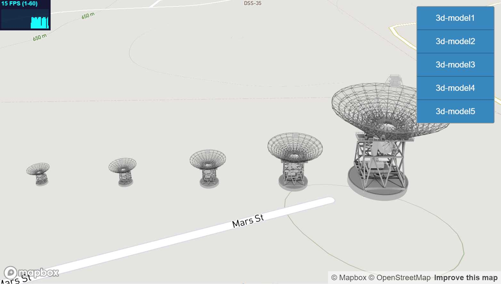 
- This sample shows how to create multiple layers dynamically with Threebox and manage different zoom ranges for each one. 
- Create multiple 3D layers in Mapbox is a heavy consumer of resources because every layer is rendered separately.
- Enabled built-in multilayer support through `multiLayer` param, this param will create an embedded internal layer in Threebox that will manage the render with a single call to tb.update so it's not needed in each layer definition. This saves a lot of resources as mapbox render loop only calls once to three.js render.
- Each layer can be hidden explicitly with a button, but also each layer has a different zoom range through `tb.setLayoutZoomRange` so the layers will hide depending on zoom level. 
- Added performance stats indicator. 
- Updated to Mapbox 2.2.0
- - - -

#### [17-azuremaps.html](https://github.com/jscastro76/threebox/blob/master/examples/17-azuremaps.html) 
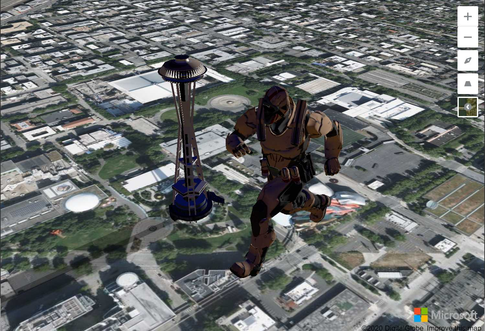 
- This sample shows how to create an Azure Maps sample through threebox using the satellite Azure Maps style.
- It adds two models, one with the Space Needle in real size and other with a Giant Soldier.
- This sample shows how to  add real sunlight position and shadows over this two models. 
- - - -

#### [18-extrusions.html](https://github.com/jscastro76/threebox/blob/master/examples/18-extrusions.html) 
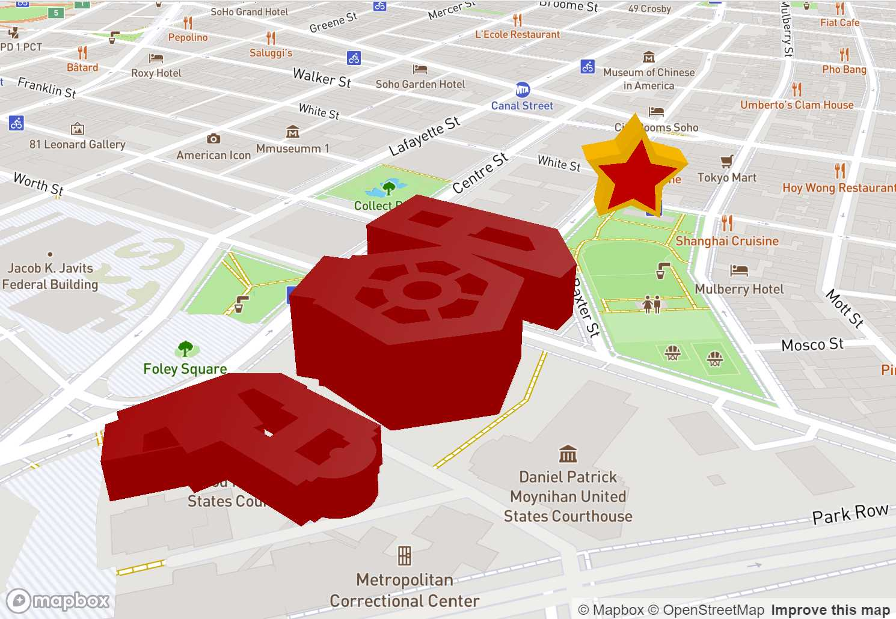 
- This sample shows how to create extrusions in two different ways. 
- The first way is to create a star based on an array of Vector2 points.
- The second way creates dynamically features from a gesJson file with real complex features from the composite layer. 
- Updated to Mapbox 2.2.0

- - - -

#### [19-fixedzoom.html](https://github.com/jscastro76/threebox/blob/master/examples/19-fixedzoom.html) 
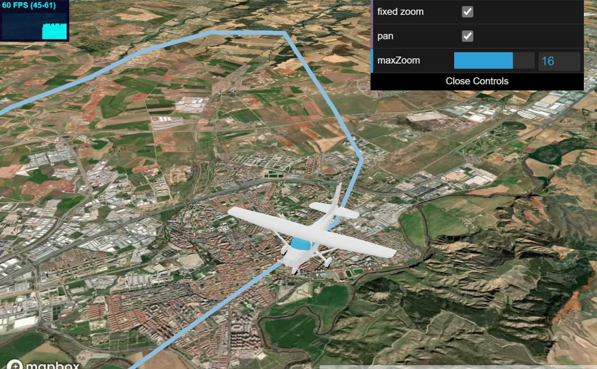 
- This sample shows how to have a fixed scale for an object at a concrete zoom level. In that way the object with preserve the same visual size when the zoom is lower than the fixed zoom value. 
- Enables the user to change dynamically to pan the camera to the object movement and change the fixed zoom level. 
- The model is attached to the event `ObjectChanged` to call `map.panTo` method from mapbox.
- Updated to Mapbox 2.2.0

- - - -

#### [20-game.html](https://github.com/jscastro76/threebox/blob/master/examples/20-game.html) 
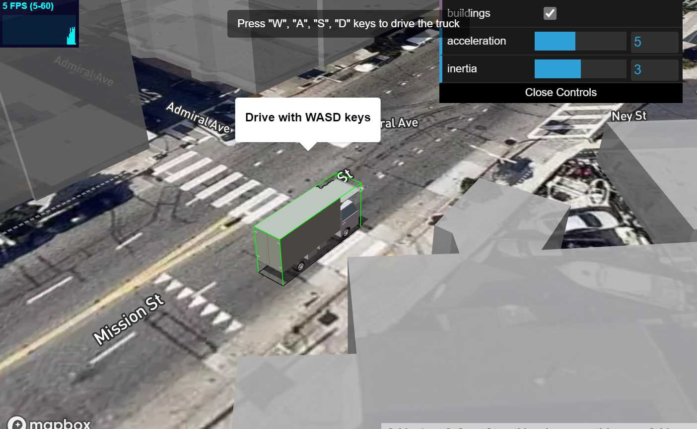 
- This sample shows how to implement an easy driving game experience with WASD controls.
- Enables the user to change dynamically to speed, inertia and to activate a fill-extrusion buildings layer;
- The model is attached to the event `ObjectChanged` to paint in red the buildings the truck.
- Updated to Mapbox 2.2.0

- - - -

#### [21-terrain.html](https://github.com/jscastro76/threebox/blob/master/examples/21-terrain.html) 
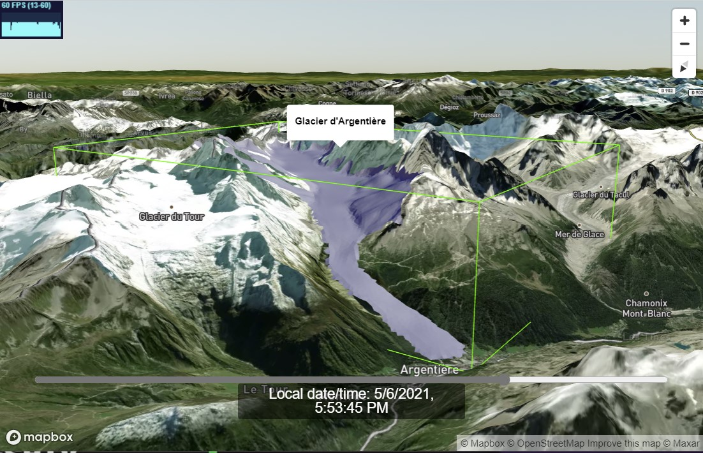 
- This sample shows how to use terrain layers and how the height of 3D models adapt automatically to terrain layer.
- Glacier d'Argentière courtesy of [@jbbarre](https://github.com/jbbarre).
- Enabled built-in sunlight position for the scene through `realSunlight`.
- Enabled built-in raycasting and selection for 3D objects through `enableSelectingObjects`, all objects can be selected and unselected.
- Enabled built-in Tooltips on for through `enableTooltips` 
- Enabled built-in atmospheric sky layer added through `sky: true` param, synced with sunlight.
- Enabled built-in terrain layer added through `terrain: true` param, synced with sunlight.
- Set the time map lights based on `setSunlight` for today.
- Changes automatically the opacity of the ground layer synced with .
- Updated to Mapbox 2.2.0

- - - -

#### [Vue.js sample](https://codesandbox.io/s/vue-threebox-sample-8k7mz)
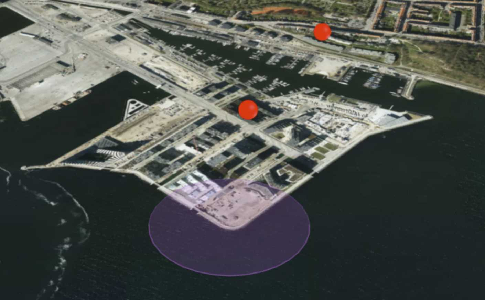 
- Courtesy [@ahoedholt](https://github.com/ahoedholt), this sample shows an implementation of threebox in Vue.js. 
- It adds two speheres and a pulse circular geometry